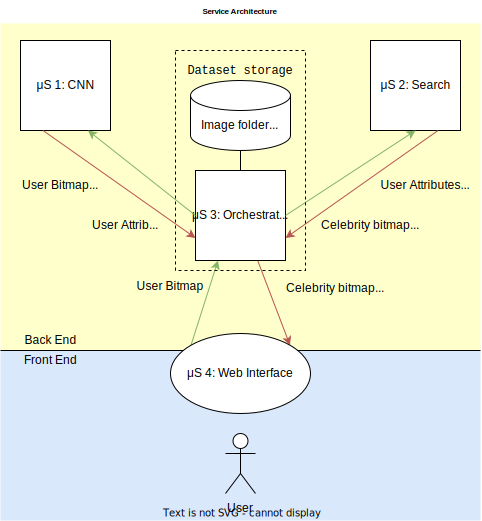

# A web game that matches the user with the celebrity they most resembles. 
Relies on unsupervised machine learning trained using https://www.kaggle.com/datasets/jessicali9530/celeba-dataset (40 features)

## Sequence of actions : 
Before release : 
### Training & Testing 
- Training and testing CNN (Microservice 1)
- Eventually building search data structure (Microservice 2)

### Playing the game : 
- Uploading photo
- Determining existing features with CNN -> user attribute vector [1,-1,....,]
- Running the search algorithm from list_atr_celebra using user attribute vector. Score = percentage of features that matches the celebrity the user most resembles 
- Display the face image with ressemblance score (e.g. 68%) and mismatched attributes (e.g. Glasses, Pale Skin)
